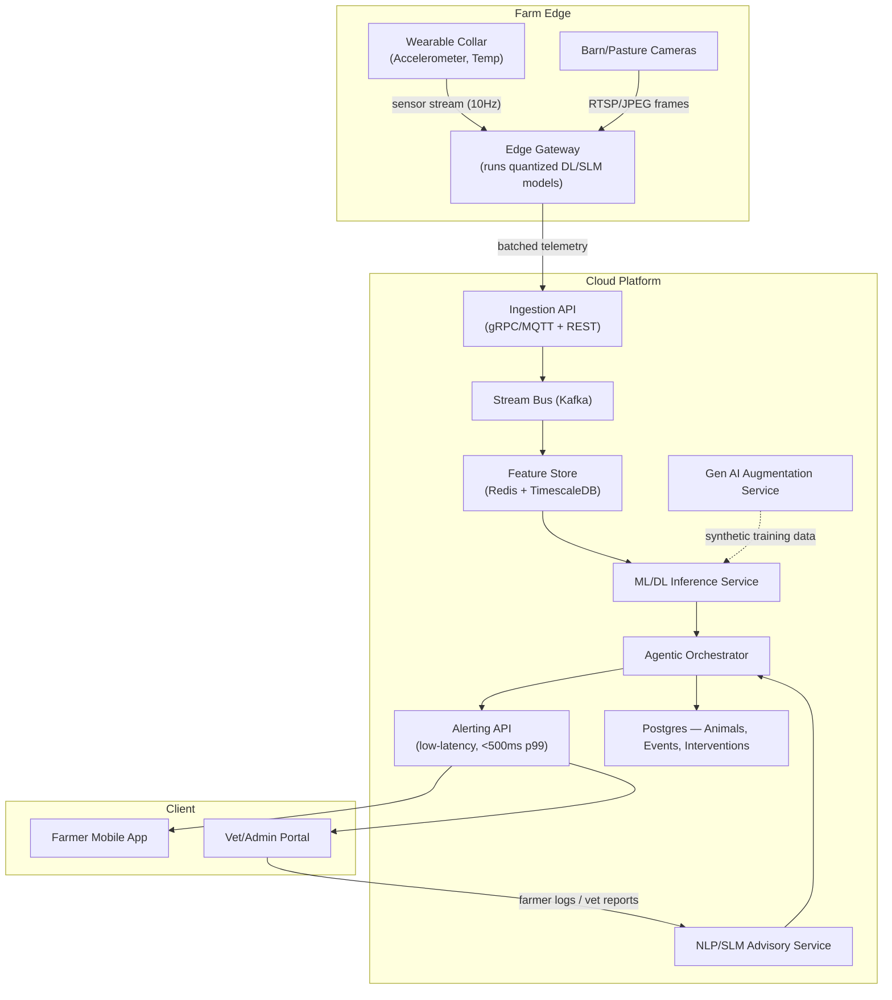
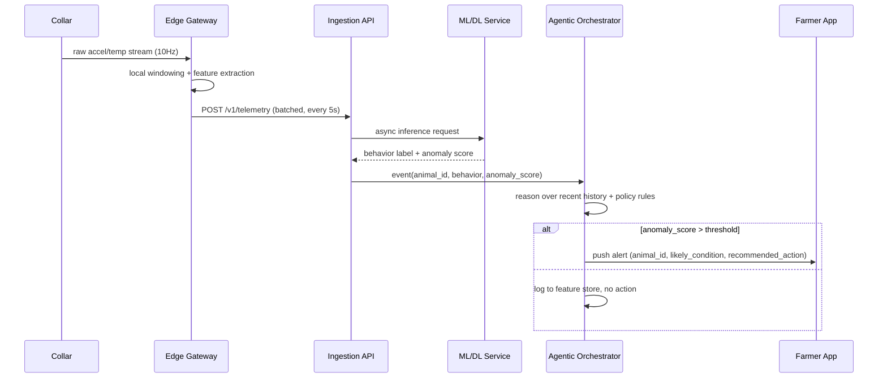

# Level LLD — Low-Level Design
## Smart Agriculture: Precision Livestock Monitoring & Management

## 1. System Architecture (C4 — Component View)



## 2. Data Flow (Sequence — Illness Alert)



## 3. Data Models

### 3.1 Core Entities (Postgres)
```sql
CREATE TABLE animal (
    animal_id UUID PRIMARY KEY,
    tag_number VARCHAR(50) UNIQUE NOT NULL,
    species VARCHAR(30) NOT NULL,       -- cattle, goat, poultry...
    breed VARCHAR(50),
    birth_date DATE,
    farm_id UUID REFERENCES farm(farm_id)
);

CREATE TABLE sensor_reading (
    reading_id BIGSERIAL PRIMARY KEY,
    animal_id UUID REFERENCES animal(animal_id),
    ts TIMESTAMPTZ NOT NULL,
    acc_x REAL, acc_y REAL, acc_z REAL,
    body_temp REAL,
    gps_lat DOUBLE PRECISION, gps_lon DOUBLE PRECISION
) PARTITION BY RANGE (ts);          -- TimescaleDB hypertable in practice

CREATE TABLE behavior_event (
    event_id BIGSERIAL PRIMARY KEY,
    animal_id UUID REFERENCES animal(animal_id),
    window_start TIMESTAMPTZ,
    window_end TIMESTAMPTZ,
    behavior VARCHAR(30),               -- grazing, lying, walking, ruminating...
    confidence REAL,
    anomaly_score REAL
);

CREATE TABLE health_alert (
    alert_id BIGSERIAL PRIMARY KEY,
    animal_id UUID REFERENCES animal(animal_id),
    created_at TIMESTAMPTZ DEFAULT now(),
    severity VARCHAR(10),               -- low, medium, high, critical
    likely_condition VARCHAR(100),
    recommended_action TEXT,
    status VARCHAR(20) DEFAULT 'open',  -- open, acknowledged, resolved
    resolved_by UUID
);

CREATE TABLE advisory_log (
    log_id BIGSERIAL PRIMARY KEY,
    farm_id UUID REFERENCES farm(farm_id),
    source VARCHAR(30),                 -- farmer_note, vet_report, kcc_query
    raw_text TEXT,
    extracted_entities JSONB,
    generated_advice TEXT,
    created_at TIMESTAMPTZ DEFAULT now()
);
```

### 3.2 Feature Store Key Schema (Redis, hot path)
```
animal:{animal_id}:latest_behavior      -> {behavior, ts, confidence}
animal:{animal_id}:rolling_stats:1h     -> {mean_temp, std_acc, lying_pct}
animal:{animal_id}:anomaly_score        -> float, TTL 5m
```

## 4. API Contracts (OpenAPI-style)

```yaml
POST /v1/telemetry
  body: { animal_id, readings: [{ts, acc_x, acc_y, acc_z, body_temp}] }
  200: { accepted: int, rejected: int }

GET /v1/animals/{animal_id}/behavior?window=1h
  200: { animal_id, behaviors: [{ts, label, confidence}] }

GET /v1/alerts?status=open&severity=high
  200: { alerts: [{alert_id, animal_id, likely_condition, recommended_action, created_at}] }

POST /v1/advisory/query
  body: { farm_id, query_text }
  200: { generated_advice, extracted_entities, confidence }

POST /v1/alerts/{alert_id}/acknowledge
  200: { alert_id, status: "acknowledged" }
```

## 5. Non-Functional Requirements
| Requirement | Target | Design Choice |
|---|---|---|
| Alert latency | p99 < 500ms from ingestion | Edge pre-processing + async Kafka pipeline; DL models quantized (TFLite) for on-gateway inference |
| Throughput | 50k sensor msgs/sec at scale | Kafka partitioned by farm_id; horizontally scaled ingestion pods |
| Availability | 99.9% for alerting path | Multi-AZ deployment, alerting API isolated from batch/training workloads |
| Data retention | 2 years raw, indefinite aggregates | TimescaleDB continuous aggregates + cold storage (S3/Glacier) for raw |
| Security | Farm data isolation | Row-level security by farm_id; mTLS between gateway and ingestion API |
| Offline resilience | Gateway buffers 24h on network loss | Local SQLite buffer + backoff retry sync |

## 6. Scalability & Reliability Notes
- **Horizontal scaling:** stateless inference services behind a load balancer;
  autoscale on Kafka consumer lag.
- **Model versioning:** all ML/DL/SLM models registered in a model registry
  (e.g., MLflow) with canary rollout before full traffic shift.
- **Backpressure:** ingestion API sheds low-priority telemetry (raw stream)
  before shedding alert-critical aggregates during overload.
- **Human-in-the-loop:** all "critical" agentic interventions require vet/farmer
  acknowledgment before any automated action (e.g., automatic feed dispenser
  change) is executed — ties directly into the Agentic level's safety design.
